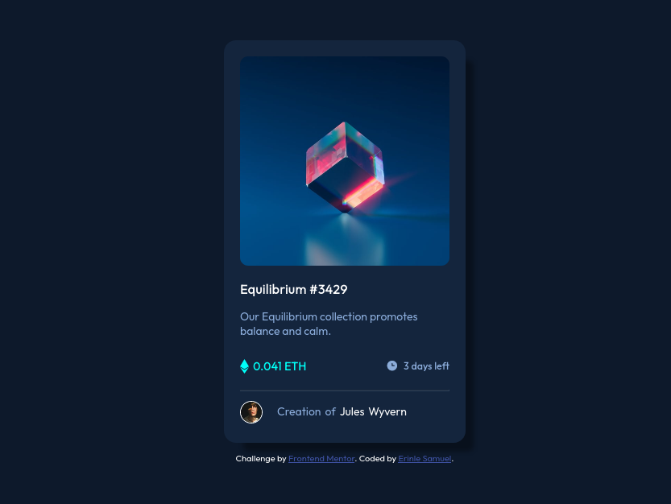

## Overview

A simple card view that displays an nft.

### The challenge

Users should be able to:

- View the optimal layout depending on their device's screen size
- See hover states for interactive elements

### Screenshot

### Links

- Solution URL: [solution URL](https://github.com/psalmuelle/nft-preview-card-component-main/)
- Live Site URL: [live site](https://nft-preview-card-by-sam.netlify.app)

## My process

The challenge was quite easy. I learnt a few tricks in CSS though. Like centering a container with flex instead of margin set to 0 and auto. No javascipt was needed! Just plain html and css.

### Built with

- Semantic HTML5 markup
- CSS custom properties
- Flexbox

### Continued development

I'm eager to start working on other projects.
Atleast, for now, no further development except improvement from suggestions from my fellow developers

### Useful resources

- [Example resource 1](https://www.csstricks.com) - This helped me with an image overlay.
- [Example resource 2](https://www.w3schools.com) - This website was very handy in building this project

## Author

- Website - [Erinle Samuel](https://github.com/psalmuelle)
- Frontend Mentor - [@psalmuelle](https://www.frontendmentor.io/profile/psalmuelle)

## Acknowledgments

Frontend mentor is really helpfull. I hope to complete more challenges on the space!